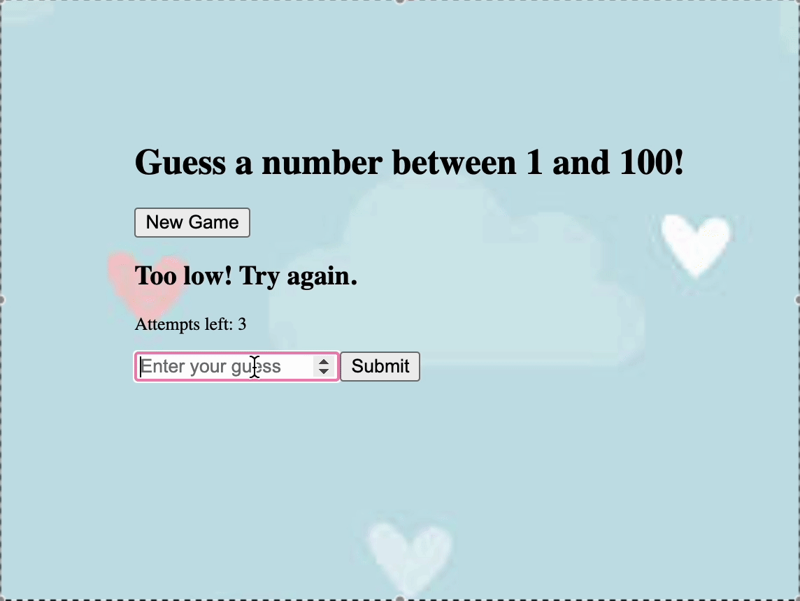

Number Guessing Game

Description
This is a simple number guessing game built using React. The game generates a random number between 1 and 100, and the player has to guess the number within three attempts. The game provides feedback whether the guess is too high or too low, and it ends when the player either guesses the correct number or runs out of attempts.

Features

A new game can be started by clicking the "New Game" button.
The player has 10 attempts to guess the correct number.
After each guess, the game informs the player whether their guess is too high, too low, or correct.
If the player guesses the number correctly, they win the game. If they run out of attempts, they lose.
Displays messages to guide the user during the game.
Provides the ability to restart the game.
Installation

Clone the repository to your local machine:

git clone https://github.com/aya-asylbek/game-app-react

Navigate to the project directory:

cd number-guessing-game

Install the required dependencies:

npm install

Start the development server:

npm start

The application should now be running on http://localhost:3000.

How to Play

The game will generate a random number between 1 and 100.
Enter your guess in the input field and click "Submit."
If the guess is correct, you win! If it's too high or too low, you can try again.
You have 10 attempts to guess the correct number. If you fail, the game is over.
Click "New Game" to start a new round.
### On Start:

### Player must enter a number between 1-100:

### If the number is too low:

### If the number is too high:

### Win Screen:

### Lose Screen:

Technologies Used
React
JavaScript 
HTML & CSS
Contributing

License
This project is licensed under the MIT License.
